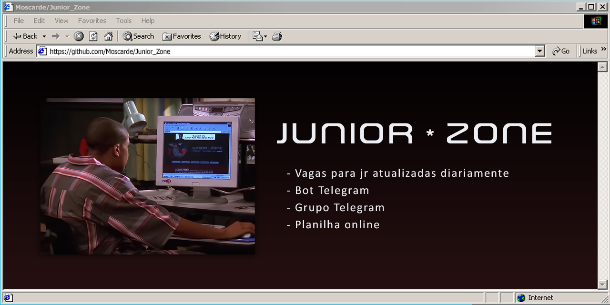
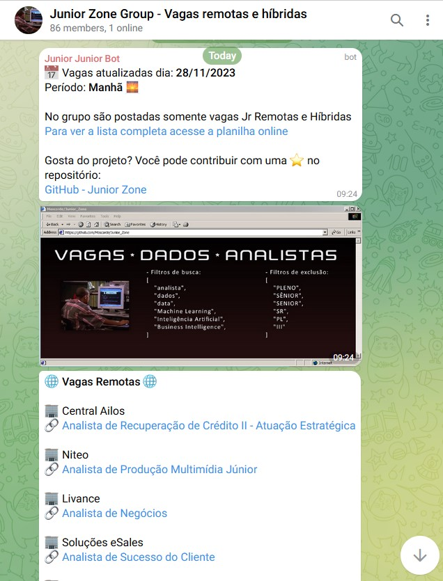
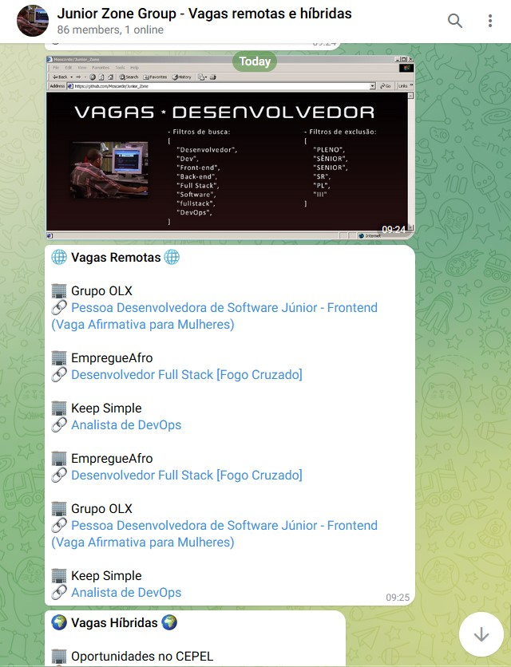
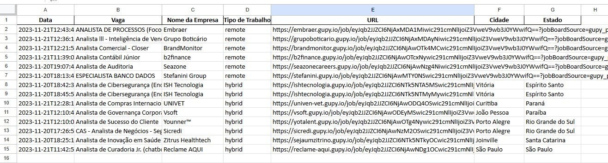

<p align="center">
    <a href="#"></a>
</p>

Junior Zone é um projeto para ajudar desenvolvedores e analistas iniciantes a encontrarem com facilidade boas oportunidades de vagas de emprego.

<div align="center">
    <table border="1" width="60%">
        <thead>
            <tr><th>🖥️ Links do projeto</th></tr>
        </thead>
        <tbody>
            <tr>
                <td><a href="https://t.me/juniorzone" target="_blank">Grupo Telegram</a></td>
            </tr>
            <tr>
                <td><a href="https://bit.ly/planilhaJuniorZone1" target="_blank">Planilha Online</a></td>
            </tr>
        </tbody>
    </table>
</div>

## ⚙️ Funcionalidades

- ✅ Busca e salva dados atualizados de plataformas de vagas
- ✅ Filtra os dados de removendo vagas de maior senioridade
- ✅ Formata e envia um relatório de vagas em um grupo acessível do telegram


Screenshots | 🖥️                            
:----------: | :--------------:              
Telegram     |  
Planilha     |                          

## ⚙️ Funcionalidades

- ✅ Busca e salva dados atualizados de plataformas de vagas
- ✅ Filtra os dados de removendo vagas de maior senioridade
- ✅ Formata e envia um relatório de vagas em um grupo acessível do telegram

## 🧰 Bibliotecas

- __pandas__: Analisa e manipula dados
- __Requests__: Requisições HTTP

## ⬇️ Como usar

1. Clone ou faça o download do repositório no seu computador..

2. Abra o terminal e navegue até o diretório onde o script está localizado.

3. Execute o script com o seguinte comando:


```shell
 python main.py
```

4. O console apresenta uma arvore de funcionalidades:
    - Fazer a requisição de novos dados
    - Filtrar e processar últimos dados
    - Enviar o relatório*
    - Enviar um texto customizado *
    - Enviar uma imagem*
    - Formatar o csv com toda a base de dados

>*Para utilizar funções com interação com o Telegram, configure as variaveis de ambiente: `TOKEN` com o token do seu bot, `MAIN_GROUP_CHAT_ID` com o id do grupo principal e `TEST_GROUP_CHAT_ID` com o id do grupo de teste.

## 📋 Pré-requisitos

Antes de usar iniciar o Junior Zone localmente, certifique-se de ter os seguintes pré-requisitos:

- Python 3.x instalado no seu sistema.
- Ter as bibliotecas instaladas. Você pode instalar usando o comando:

``` shell
pip install -r pandas requests python-dotenv
```

## ⌛ Progresso e metas de desenvolvimento

- [x] Fazer requisição de dados a api da gupy
- [x] Salvar os dados em arquivos locais para analises futuras
- [x] Carregar, filtrar e formatar os dados para saídas em formato de mensagem e planílha
- [x] Integrar com um bot telegram
- [x] Enviar relatorios diários pelo bot
- [x] Desenvolver modelo de planilha no googlesheets e automatizar sua atualização
- [ ] Desenvolver mais funcionalidades para o bot
- [ ] Abranger outras áreas como front e back-end
- [ ] Buscar dados em outras plataformas

E talvez algumas funcionalidades a mais

## 🙏 Agradecimentos especiais

O readme deste repositório foi inspirado no readme template do [repo-full-readme](https://github.com/Dener-Garcia/repo-full-readme/) por [Dener Garcia](https://github.com/Dener-Garcia)

## ⭐ EsmolaPill

Gostou do projeto? Você pode contribuir com uma ⭐️ aqui no repositório no repositório!


## 💬 Vamos conectar?

<div align="left">
  <a href="https://linkedin.com/in/moscarde" target="_blank">
    
  </a>
  <a href="https://github.com/moscarde" target="_blank">
    
  </a>
    
  
</div>